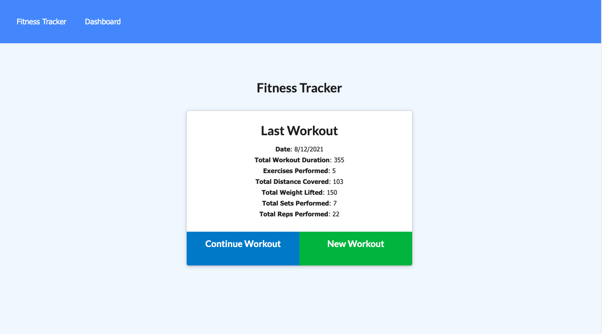
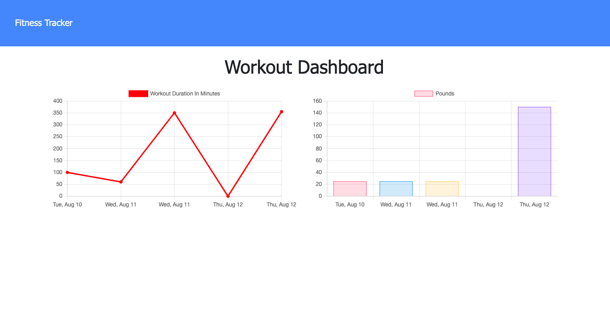

# 18 Nosql Homework

## Creating a Workout Tracker

This is the eighteenth assignment for the MSU Coding Bootcamp; to create a the backend, database and routes of a workout tracker, and to deploy it on Heroku.  Using Mongoose witha  Mongo database, and Express router, the app will also utilize MongoDB Atlas.

The app allows a user to track daily workouts. The user can log multiple exercises in a workout, can track the workout data, can track distance for cardio workouts.

### Live Links
- [Daniel Shoup's Workout Tracker Repisitory](https://github.com/danshoup/WorkoutTracker)
- [Daniel Shoup's link to the deployed Workout Tracker on Heroku](https://workout-tracker-msu-2021.herokuapp.com/)

### Workout Tracker Screenshot

## Acceptance Criteria

- Folder structure follows the MVC paradim.

- App uses the 'express-handlebars' package to implement Handlebars.js for Views

- UI is is clean and polished, and user experience is intuitive and easy to navigate.

- Application resembles the mock-up provided in the homework instructions.

- Application must be deployed to Heroku

- Application must be deployed at a live URL, and load with no errors.

- GitHub URL must be submitted, and the repository must contain the application code.

- Application console is free of errors.

- Repository has a unique name and follows best practices for naming, indentation, comments, and contains descriptive commit messages.  The repository also contains a quality READMY file with description, screenshot,a nd link to deployed application.

- URL of the functional, deployed application, and the URL of the GitHub repository must be submitted.

